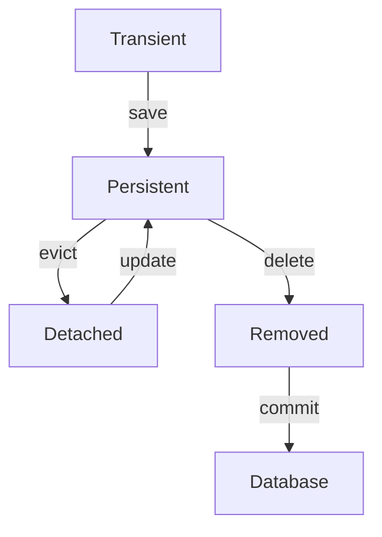

# Hibernate Demo

This project demonstrates the basic usage of Hibernate with Spring Boot.

## Prerequisites

- Java Development Kit (JDK) 8 or higher
- Maven
- Spring Boot

## Setup

1. Clone the repository:
    ```bash
    git clone https://github.com/yourusername/hibernate-demo.git
    cd hibernate-demo
    ```

2. Update the database configuration in `src/main/resources/application.properties`:
    ```properties
    spring.datasource.url=jdbc:mysql://localhost:3306/yourdatabase
    spring.datasource.username=yourusername
    spring.datasource.password=yourpassword
    spring.jpa.hibernate.ddl-auto=update
    ```

3. Build and run the application:
    ```bash
    mvn clean install
    mvn spring-boot:run
    ```

## Usage

- Access the application at `http://localhost:8080`.

## License

This project is licensed under the MIT License.
## Basic Hibernate Configuration

To configure Hibernate in your Spring Boot application, follow these steps:

### Cascading Types

Hibernate provides different types of cascading options that can be used to propagate operations from a parent entity to its associated child entities. The cascading types are:

- `CascadeType.PERSIST`: Propagates the persist operation from the parent to the child entity.
- `CascadeType.MERGE`: Propagates the merge operation from the parent to the child entity.
- `CascadeType.REMOVE`: Propagates the remove operation from the parent to the child entity.
- `CascadeType.REFRESH`: Propagates the refresh operation from the parent to the child entity.
- `CascadeType.DETACH`: Propagates the detach operation from the parent to the child entity.
- `CascadeType.ALL`: Propagates all operations (persist, merge, remove, refresh, detach) from the parent to the child entity.

#### Example

Here is an example of how to use cascading types in a Hibernate entity:

```java
@Entity
public class Parent {

    @Id
    @GeneratedValue(strategy = GenerationType.IDENTITY)
    private Long id;

    @OneToMany(cascade = CascadeType.ALL, orphanRemoval = true)
    private List<Child> children = new ArrayList<>();

    // getters and setters
}

@Entity
public class Child {

    @Id
    @GeneratedValue(strategy = GenerationType.IDENTITY)
    private Long id;

    // getters and setters
}
```

In this example, any operation performed on the `Parent` entity will be cascaded to the `Child` entities.

### Managing Transactions

In Hibernate, transactions are used to ensure data integrity and consistency. Transactions allow you to group multiple operations into a single unit of work, which can be committed or rolled back as a whole.

#### Using Spring Boot and @Transactional

Spring Boot simplifies transaction management with the `@Transactional` annotation. This annotation can be applied to methods or classes to define the scope of a single database transaction.

#### Example

Here is an example of how to use the `@Transactional` annotation in a Spring Boot application:

```java
@Service
public class MyService {

    @Autowired
    private MyRepository myRepository;

    @Transactional
    public void performTransactionalOperation() {
        // Perform database operations
        myRepository.save(new MyEntity());
        // Other operations
    }
}
```

In this example, the `performTransactionalOperation` method is executed within a transaction. If any exception occurs during the execution of this method, the transaction will be rolled back automatically.

#### Programmatic Transaction Management

If you need more control over transactions, you can manage them programmatically using the `PlatformTransactionManager` interface.

```java
@Service
public class MyService {

    @Autowired
    private PlatformTransactionManager transactionManager;

    public void performTransactionalOperation() {
        TransactionStatus status = transactionManager.getTransaction(new DefaultTransactionDefinition());

        try {
            // Perform database operations
            // Commit the transaction
            transactionManager.commit(status);
        } catch (Exception e) {
            // Rollback the transaction in case of an error
            transactionManager.rollback(status);
            throw e;
        }
    }
}
```

In this example, transactions are managed manually, providing more flexibility and control over the transaction boundaries.

By using transactions, you can ensure that your database operations are executed in a consistent and reliable manner.

### Transaction Propagation Types

Spring provides several types of transaction propagation behaviors that determine how transactions are managed when they are called within other transactions. The propagation types are:

- `REQUIRED`: Supports a current transaction, creates a new one if none exists. This is the default setting.
- `REQUIRES_NEW`: Creates a new transaction, suspending the current transaction if one exists.
- `MANDATORY`: Supports a current transaction, throws an exception if none exists.
- `NESTED`: Executes within a nested transaction if a current transaction exists, otherwise behaves like `REQUIRED`.
- `NEVER`: Executes non-transactionally, throws an exception if a transaction exists.
- `NOT_SUPPORTED`: Executes non-transactionally, suspending the current transaction if one exists.
- `SUPPORTS`: Supports a current transaction, executes non-transactionally if none exists.

#### Example

Here is an example of how to use different transaction propagation types in a Spring Boot application:

```java
@Service
public class MyService {

    @Autowired
    private MyRepository myRepository;

    @Transactional(propagation = Propagation.REQUIRED)
    public void requiredTransaction() {
        // Perform database operations
    }

    @Transactional(propagation = Propagation.REQUIRES_NEW)
    public void requiresNewTransaction() {
        // Perform database operations
    }

    @Transactional(propagation = Propagation.MANDATORY)
    public void mandatoryTransaction() {
        // Perform database operations
    }

    @Transactional(propagation = Propagation.NESTED)
    public void nestedTransaction() {
        // Perform database operations
    }

    @Transactional(propagation = Propagation.NEVER)
    public void neverTransaction() {
        // Perform database operations
    }

    @Transactional(propagation = Propagation.NOT_SUPPORTED)
    public void notSupportedTransaction() {
        // Perform database operations
    }

    @Transactional(propagation = Propagation.SUPPORTS)
    public void supportsTransaction() {
        // Perform database operations
    }
}
```

In this example, each method is configured with a different transaction propagation type, demonstrating how to control transaction behavior in various scenarios.

## Basic and Advanced Annotations in Hibernate

Hibernate provides a variety of annotations to map Java objects to database tables and define relationships between them. Here are some of the basic and advanced annotations used in Hibernate:

### Basic Annotations

- `@Entity`: Specifies that the class is an entity and is mapped to a database table.
- `@Table`: Specifies the table name in the database.
- `@Id`: Specifies the primary key of an entity.
- `@GeneratedValue`: Specifies the generation strategy for primary keys.
- `@Column`: Specifies the column name in the database.
- `@Basic`: Specifies that a field is to be persisted.
- `@Transient`: Specifies that a field is not to be persisted.

#### Example

```java
@Entity
@Table(name = "users")
public class User {

    @Id
    @GeneratedValue(strategy = GenerationType.IDENTITY)
    private Long id;

    @Column(name = "username", nullable = false, unique = true)
    private String username;

    @Column(name = "password", nullable = false)
    private String password;

    @Transient
    private String nonPersistentField;

    // getters and setters
}
```

### Advanced Annotations

- `@OneToOne`: Defines a one-to-one relationship between two entities.
- `@OneToMany`: Defines a one-to-many relationship between two entities.
- `@ManyToOne`: Defines a many-to-one relationship between two entities.
- `@ManyToMany`: Defines a many-to-many relationship between two entities.
- `@JoinColumn`: Specifies the foreign key column.
- `@JoinTable`: Specifies the join table for many-to-many relationships.
- `@Embedded`: Embeds a component class.
- `@Embeddable`: Specifies a class whose instances are stored as an intrinsic part of an owning entity.
- `@ElementCollection`: Defines a collection of basic or embeddable types.

#### Example

```java
@Entity
public class Order {

    @Id
    @GeneratedValue(strategy = GenerationType.IDENTITY)
    private Long id;

    @OneToOne
    @JoinColumn(name = "customer_id")
    private Customer customer;

    @OneToMany(mappedBy = "order", cascade = CascadeType.ALL)
    private List<OrderItem> orderItems = new ArrayList<>();

    // getters and setters
}

@Entity
public class Customer {

    @Id
    @GeneratedValue(strategy = GenerationType.IDENTITY)
    private Long id;

    @Column(name = "name", nullable = false)
    private String name;

    // getters and setters
}

@Entity
public class OrderItem {

    @Id
    @GeneratedValue(strategy = GenerationType.IDENTITY)
    private Long id;

    @ManyToOne
    @JoinColumn(name = "order_id")
    private Order order;

    @Column(name = "product_name", nullable = false)
    private String productName;

    // getters and setters
}
```

In this example, `Order` has a one-to-one relationship with `Customer` and a one-to-many relationship with `OrderItem`. The `OrderItem` entity has a many-to-one relationship with `Order`.

By using these annotations, you can define complex relationships and mappings between your Java objects and database tables, making it easier to work with relational data in a more object-oriented way.

## Hibernate Caching

Hibernate provides a caching mechanism to improve the performance of database operations. There are two levels of caching in Hibernate:

### First-Level Cache

The first-level cache is associated with the `Session` object. It is enabled by default and cannot be disabled. The first-level cache stores entities that are associated with a specific session. When you query an entity within the same session, Hibernate will first check the first-level cache before querying the database.

#### Example

```java
Session session = sessionFactory.openSession();
Transaction tx = session.beginTransaction();

// Load entity from the database
MyEntity entity1 = session.get(MyEntity.class, 1L);

// Load the same entity again, this time it will be retrieved from the first-level cache
MyEntity entity2 = session.get(MyEntity.class, 1L);

tx.commit();
session.close();
```

In this example, the second call to `session.get` will retrieve the entity from the first-level cache instead of querying the database.

### Second-Level Cache

The second-level cache is associated with the `SessionFactory` object. It is not enabled by default and must be configured explicitly. The second-level cache stores entities across multiple sessions and can be shared among them. This cache is useful for reducing database access for frequently accessed data.

#### Configuring Second-Level Cache

To enable the second-level cache, you need to configure it in the `hibernate.cfg.xml` file or `application.properties` file and specify a cache provider.

##### Example Configuration in `application.properties`

```properties
spring.jpa.properties.hibernate.cache.use_second_level_cache=true
spring.jpa.properties.hibernate.cache.region.factory_class=org.hibernate.cache.ehcache.EhCacheRegionFactory
spring.jpa.properties.net.sf.ehcache.configurationResourceName=/ehcache.xml
```

##### Example Configuration in `hibernate.cfg.xml`

```xml
<property name="hibernate.cache.use_second_level_cache">true</property>
<property name="hibernate.cache.region.factory_class">org.hibernate.cache.ehcache.EhCacheRegionFactory</property>
<property name="net.sf.ehcache.configurationResourceName">/ehcache.xml</property>
```

#### Example Entity Configuration

```java
@Entity
@Cacheable
@org.hibernate.annotations.Cache(usage = CacheConcurrencyStrategy.READ_WRITE)
public class MyEntity {

    @Id
    @GeneratedValue(strategy = GenerationType.IDENTITY)
    private Long id;

    // other fields, getters, and setters
}
```

In this example, the `@Cacheable` annotation and `@org.hibernate.annotations.Cache` annotation are used to enable second-level caching for the `MyEntity` entity.

By using the first-level and second-level caches, you can significantly improve the performance of your Hibernate application by reducing the number of database queries and leveraging cached data.

## Entity Lifecycle in Hibernate

In Hibernate, entities go through different states during their lifecycle. Understanding these states is crucial for effectively managing entity persistence and interactions with the database. The main states of an entity lifecycle are:

1. **Transient**: An entity is in the transient state when it is instantiated using the `new` operator but is not associated with a Hibernate `Session`. It is not yet persisted to the database and has no persistent identity.

2. **Persistent**: An entity is in the persistent state when it is associated with a Hibernate `Session`. It is managed by Hibernate and any changes made to the entity will be synchronized with the database.

3. **Detached**: An entity is in the detached state when it is no longer associated with a Hibernate `Session`. It was previously in the persistent state but the session has been closed or the entity has been evicted from the session.

4. **Removed**: An entity is in the removed state when it is scheduled for deletion from the database. It will be deleted when the transaction is committed.


### Example

Here is an example demonstrating the different states of an entity lifecycle:

```java
Session session = sessionFactory.openSession();
Transaction tx = session.beginTransaction();

// Transient state
MyEntity entity = new MyEntity();
entity.setName("Example");

// Persistent state
session.save(entity);

// Detached state
session.evict(entity);

// Persistent state again
session.update(entity);

// Removed state
session.delete(entity);

tx.commit();
session.close();
```

In this example:
- The entity is in the transient state when it is created using the `new` operator.
- The entity moves to the persistent state when it is saved using `session.save`.
- The entity becomes detached when it is evicted from the session using `session.evict`.
- The entity returns to the persistent state when it is updated using `session.update`.
- The entity moves to the removed state when it is deleted using `session.delete`.

By understanding the entity lifecycle states, you can effectively manage entity persistence and interactions with the database in your Hibernate applications.

## Entity Lifecycle Flow Diagram

Below is a flow diagram that illustrates the different states of an entity lifecycle in Hibernate:



In this diagram:
- The entity starts in the **Transient** state.
- When the entity is saved, it moves to the **Persistent** state.
- If the entity is evicted from the session, it moves to the **Detached** state.
- The entity can return to the **Persistent** state if it is updated.
- When the entity is deleted, it moves to the **Removed** state.
- Finally, upon committing the transaction, the entity is removed from the **Database**.

This flow diagram helps visualize the transitions between different states of an entity in Hibernate.