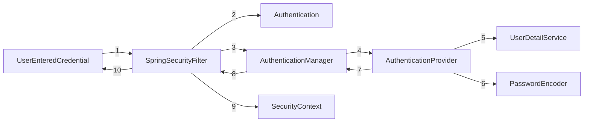

# Spring Security

### What is security and why we need it?
* Security is for protecting data and bussiness logic inside the application.
* Security for a web application will be implemented in a different way like using firewalls, HTTPs, SSL, Authentication, Authhorization etc.
* Using security we should also avoid most common security attack like CSRF, SEssion Fixation, XSS, CORS etc. inside our application

## Spring Security Flow Diagram


```mermaid
sequenceDiagram
    Spring Security Filter->>+AuthenticationManager()
    Alice->>+John: John, can you hear me?
    John-->>-Alice: Hi Alice, I can hear you!
    John-->>-Alice: I feel great!
```

# Spring Security Classes
### SpringBootWebSecurityConfiguration (Class to create the default SecurityFilterChain bean )
* SpringBootWebSecurityConfiguration --> defaultSecurityFilterChain

### UserDetailsService (I) loadUserByUsername
* CachingUserDetailsService
* InMemoryUserDetailsManager
* JdbcDaoImpl
* ReactiveUserDetailsServiceAdapter in WithUserDetailsSecurityContextFactory

### interface UserDetailsManager extends UserDetailsService 
