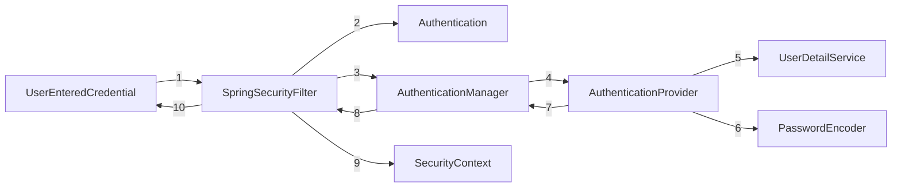

Spring Security Flow

```mermaid
flowchart LR
    A[UserEnteredCredential] --1--> B[SpringSecurityFilter]
    B--2-->C[Authentication]
    B--3-->D[AuthenticationManager]
    D--4-->E[AuthenticationProvider]
    E--5-->F[UserDetailService]
    E--6-->G[PasswordEncoder]
    E--7-->D
    D--8-->B
    B--9-->H[SecurityContext]
    B--10-->A
```